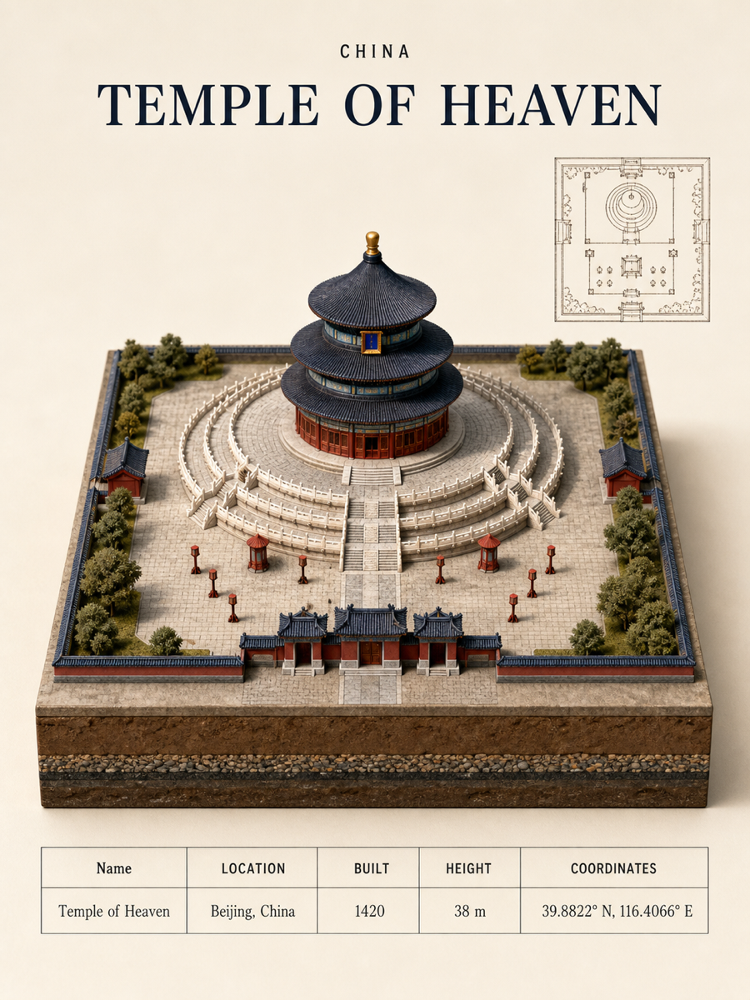
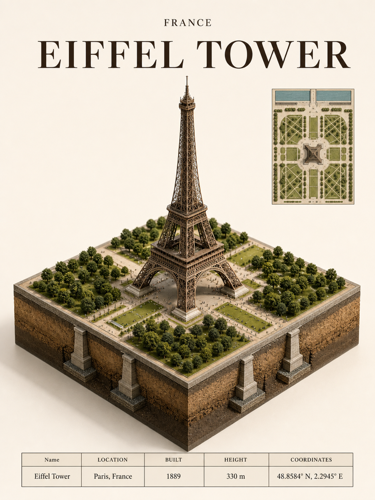

# Travel Photo Miniature Poster

将旅行照片重建为具有实体建筑模型摄影质感的 3:4 竖版微缩沙盘海报。Skill 会分析照片中的地标、建筑、地形、植被、水体和空间关系，并生成带可信地下剖面、右上角无文字场景平面图与底部地标信息表的收藏级海报。

## 核心能力

- 以真实高度关系和统一比例尺重建建筑、地标、树木、人物、车辆与景观。
- 强制使用独立 3D 几何、实体厚度、遮挡关系和微小接触阴影，避免照片贴图或航拍纹理效果。
- 默认生成可信的地下剖面；证据不足时只表现基础、土层、岩层、根系与地下水，不虚构密道或遗迹。
- 在右上角生成与沙盘空间关系一致的无文字场景平面图，不包含摄影点位、路线或导航 UI。
- 自动核验并填写地标名称、位置、建造年份、高度与坐标；无法核实时诚实回退。
- 固定输出 3:4 竖版，并使用锁定的标题、沙盘尺寸、信息表、安全边距和暖象牙背景。
- 在后续局部编辑中锁定未被点名的透视、高度、占地、位置和比例，减少意外比例漂移。

## 使用方式

在 Codex 中上传一张旅行照片并调用：

```text
$travel-photo-miniature-poster
```

也可以直接描述修改目标，例如：

```text
使用 $travel-photo-miniature-poster 将这张旅行照片制作成 3:4 实体建筑微缩沙盘海报。
```

## 著名建筑测试示例

以下图片用于快速检查 Skill 在不同建筑类型下的输出表现。它们覆盖浅基础坛庙、高塔工程基础和宗教建筑地层剖面三类典型场景。

| 天坛 · 北京 | 埃菲尔铁塔 · 巴黎 | 圣瓦西里大教堂 · 莫斯科 |
|---|---|---|
|  |  |  |
| 浅层夯土台基、排水与克制的地下厚度 | 四点基础、铁塔真实比例与场地轴线 | 多穹顶独立几何、砖石基础与地层连续性 |

测试时重点检查：画布是否严格为 3:4、底座是否保持规则方形棱柱、建筑是否由独立 3D 几何构成、地下结构是否符合建筑类型、右上角平面图是否与沙盘一致，以及底部信息表是否清晰且字段一致。

## 安装

将仓库克隆到 Codex Skills 目录：

```bash
git clone https://github.com/sxt417/travel-photo-miniature-poster.git ~/.codex/skills/travel-photo-miniature-poster
```

重新打开 Codex 后即可通过 `$travel-photo-miniature-poster` 调用。

## 文件结构

```text
travel-photo-miniature-poster/
├── SKILL.md
├── README.md
├── agents/
│   └── openai.yaml
├── assets/
│   ├── layout-reference-3x4.png
│   └── examples/
│       ├── temple-of-heaven.png
│       └── eiffel-tower.png
└── references/
    └── global-underground-sections.md
```

- `SKILL.md`：场景分析、比例约束、地下剖面、平面图、版式与质量门禁。
- `agents/openai.yaml`：Codex 中展示的 Skill 名称、简介和默认调用提示。
- `assets/layout-reference-3x4.png`：3:4 海报构图、标题层级、平面图与信息表的视觉参考。
- `assets/examples/`：README 中用于回归检查的著名建筑测试图。
- `references/global-underground-sections.md`：面向全球建筑类型的地下剖面生成规则。

## 输出原则

照片用于理解场景身份和空间语义，不用于直接复制原始拍摄透视。最终结果应首先被识别为一件真实存在、经过摄影棚拍摄的建筑微缩模型，其次才是对旅行地点的还原。
